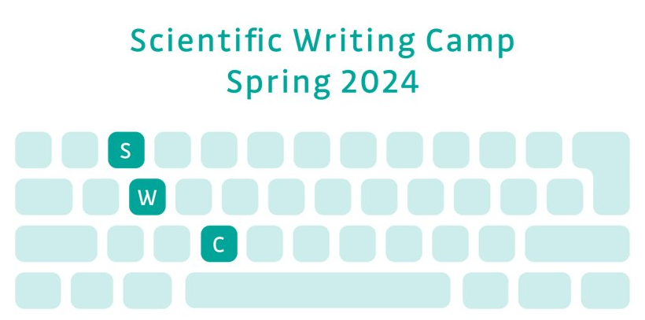

# Welcome to the NEUROSHEEP at Scientific Writing Camp 2024

## Bridging Disciplines at VŠB-TUO

Join us at the Scientific Writing Camp (SWC) 2024 hosted by [VŠB - Technical University of Ostrava](https://www.vsb.cz/en/), where our team innovate across disciplines. Our goal is to identify knowledge gaps and foster interdisciplinary research that spans multiple faculties.

### About SWC 2024

The Scientific Writing Camp 2024, held by the [PhD Academy](https://www.vsb.cz/phdakademie/en) at VŠB-TUO, is an initiative to encourage collaboration among diverse academic disciplines. This event focuses on identifying key areas where interdisciplinary research can address complex challenges facing society today.

### Meet the Neuronauts

- **Martina Ládrová** - Expert in Machine Learning with applications in healthcare and biomedical research. Researcher in sensor technology and its applications in biomedical engineering.
- **Kateřina Barnová** - Expert in Machine Learning with applications in healthcare and biomedical research. Researcher in sensor technology and its applications in biomedical engineering.
- **Robert Šamárek** - Data Scientist with expertise in Machine Learning, AI, LLM, data analysis, and visualization.

### Meet the 50206

- **Maidiya Bahate** - Expert in Economics with applications in human bahavior and its impact on stock market.
- **Xiong Jialei** - Expert in Economics with applications in human bahavior and its impact on stock market.

### Interdisciplinary Collaboration Goals

- **To Identify Research Gaps** - We aim to uncover and address significant research gaps that require interdisciplinary approaches.
- **To Foster Collaboration** - By bringing together experts from different faculties, we seek to create synergies that lead to innovative solutions.
- **To Publish Interdisciplinary Research** - Our objective is to produce high-impact research papers that reflect our combined expertise NLT September 2025.

### Latest News and Updates

#### TODO List

- [x] Define the research question
- [x] Literature review
- [ ] Draft the investor typology questionnaire
- [x] Draft a battery of stock investment scenarios
- [ ] Identify key research methodologies
- [ ] Prepare a research proposal (presentation for day 2)

#### Research Question

> How does an emotional state feedback loop affect the e-learning process in the financial domain?

> (particularly in decision-making for stock investment scenarios)

#### Novelty and Literature Review Highlights

TBD

#### Interdisciplinarity

- **Economics**: Design of stock investment scenarios and understanding investor behavior and decision-making in stock investments.
- **Sensors and Wearables**: Collecting real-time emotional feedback data through HRV sensors (smartwatches).
- **Data Science and Machine Learning**: Data processing and analysis to infer emotional states from HRV data and their impact on decision-making.

#### Motivation/Urgency

- **to address the emotional aspect of decision-making, which is often overlooked in traditional financial education**
- to educate and increase financial literacy and decision-making skills in the general population
- to gather consensed data on correlations between emotional states and decision-making in various financial scenarios among different investor typologies for future research

#### The Goal

- to design (not to develop) a gamified e-learning platform that integrates real-time emotional feedback
- to enhance financial decision-making skills by integrating real-time emotional feedback (leveraging Heart Rate Variability data) to tailor learning experiences and improve outcomes in financial education.
- To investigate the impact of real-time emotional state feedback on the e-learning process in the financial domain.
- To understand how emotional state feedback affects decision-making in stock investment scenarios.
- To identify the key variables that influence the learning process in the financial domain.

#### Target Audience

- 18+ individuals interested in finance education, particurally in stock market investments.

#### E-Learning Design

- Gamified e-learning platform
- Primarily mobile app
- Secondary web app
- Text-based scenarios with multiple-choice questions
- Real-time HRV feedback loop

#### Sensor Technology

- Smartphone
- Smartwatch with heart rate monitor

#### Methodology

- distinguish between different investor typologies (risk-averse, risk-neutral, risk-seeking) using a questionnaire
- battery of stock investment scenarios, multiple-choice 4-option questions, one incorrect for all types of investors
- after each scenario, participants receive the correct answer for their investor type and, if incorrect, why the answer is not ideal for their type
- participants will also receive information on how their emotions may have influenced their decision-making and how to work with this knowledge in the future
- participants will be asked to rate their emotional state before and after each scenario

nice to have:

- graph of HRV over time after completing the task (one whole game) with each scenario vertical line at the end of the scenario
- comapring tasks' scores over time (getting better?)
- comparing HRV over time (getting more stable? participants getting more resilient to stress?)
- cloning scenarios utilizing Generative AI (LLMs) to generate more distinct scenarios
- translating scenarios to different languages using LLMs
- comparison of learning curves between samples with and without HRV feedback

#### Journal

categories:

- Psychology
- Behavioral Economics
- Education
- ...

#### Takeaways

- multinational cooperation
- interdisciplinary research

#### Key Variables

1. **Heart Rate Variability (HRV)**: As a measure of the participant's emotional state. HRV data collected from a smartwatch or similar device will be used to infer stress levels and emotional states during decision-making tasks.

2. **Decision-Making Accuracy**: This variable assesses the correctness and precision of decisions made by participants in simulated stock investment scenarios. It can be quantified by comparing the decisions made to optimal decisions based on standard financial theories or successful historical outcomes.

3. **Learning Engagement**: This includes metrics such as session duration, interaction rates with the e-learning platform, and completion rates of tasks or modules. It gauges how actively participants are engaging with the educational content.

4. **Emotional Feedback Effectiveness**: Measured by the change in decision-making accuracy and learning engagement before and after the introduction of HRV-based emotional feedback. This variable assesses the direct impact of emotional state feedback on learning outcomes.

5. **Cognitive Load**: Assessed through subjective self-report measures (like Likert scales).

6. **User Satisfaction and Perceived Utility**: Collected via in-app automated surveys or interviews post-interaction, this variable measures how users perceive the usefulness of the HRV feedback and the overall e-learning experience.

#### Architecture

- **Frontend**: Mobile app (React Native), also aviailable as a web app (React) - but without HRV feedback
- **Backend**: Web app (FastAPI or Flask)
- **Hosting**: Amazon Web Services (AWS)
- **Database**: PostgreSQL or MongoDB
- **Machine Learning**: Python (scikit-learn, Prophet)
- **LLM**: OpenAI (via API)

#### Potential oponents' questions

- How do you plan to measure the emotional state of the participants?
- What are the key variables that you will be analyzing in the study?
- How do you plan to control for external factors that may influence the participants' emotional state?
- What are the potential limitations of your study, and how do you plan to address them?
- Who are the key stakeholders that will benefit from the findings of your study?
- Who is going to pay for the game development? What is the budget for the project? What is the business model?

#### Key Milestones

- **Day 1** - Define the research question and methodology, conduct a literature review
- **Day 2** - Prepare a research proposal
- TBD

#### Unsorted Ideas

- Limited time to make decisions (stress)
- other stressors (TBD)

#### Connect With Us

- LinkedIn: [Connect with us on LinkedIn](https://www.linkedin.com/in/robert-s-2b05a771)
- GitHub: [Explore our interdisciplinary projects](https://github.com/vsb-data/swc_2024)

---

Thank you for visiting our page. We look forward to breaking new ground together at SWC 2024 and beyond!
